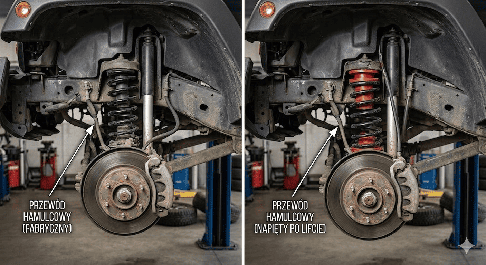
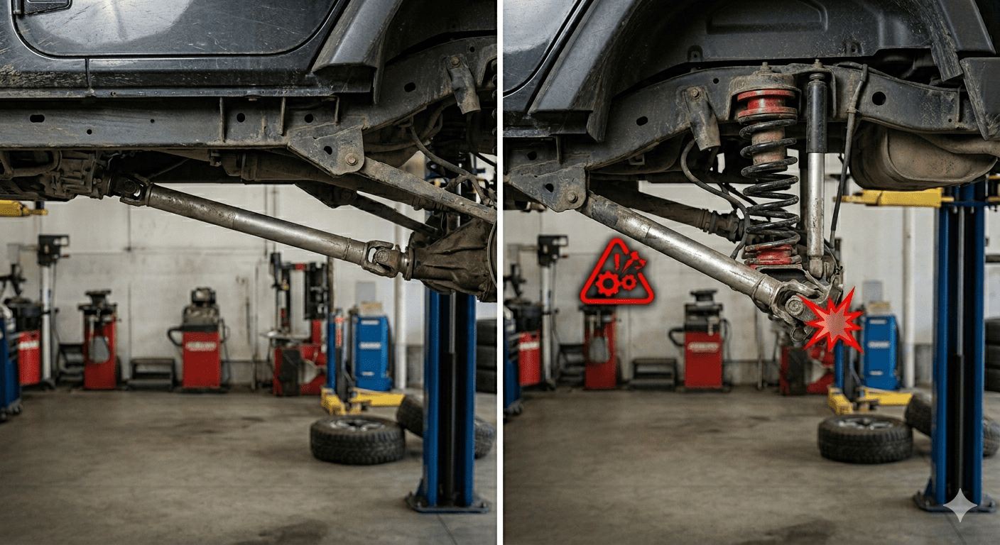
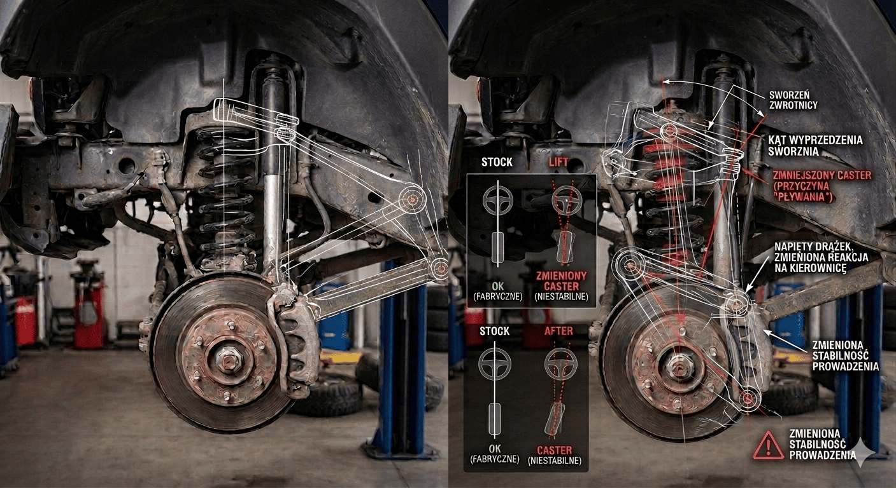
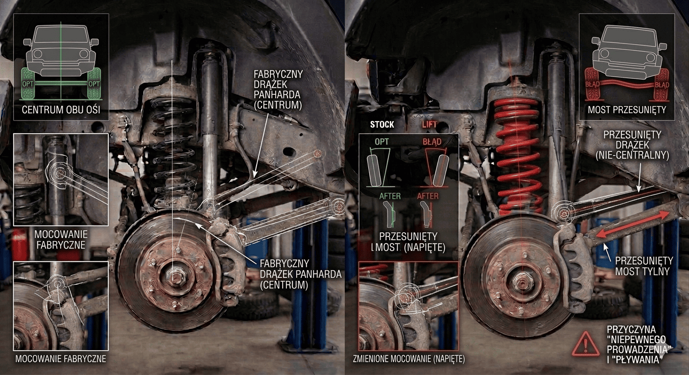

Lift na podkładkach to dla wielu osób pierwszy krok w świat modyfikacji terenowych. Wizja jest kusząca: niewielki koszt, szybki montaż, zauważalny efekt wizualny i przynajmniej teoretycznie lepsze możliwości w terenie.

Auto wygląda bardziej „off-roadowo”, większe koło zaczyna mieć sens, a prześwit rośnie bez ingerencji w skomplikowane elementy zawieszenia.

Problem polega na tym, że sam lift jest tylko początkiem całego procesu. W praktyce podniesienie auta uruchamia lawinę zmian, które wpływają na geometrię, trwałość podzespołów i bezpieczeństwo. Lista rzeczy do poprawy często zaskakuje osoby, które spodziewały się prostej modyfikacji.

Jeśli zakładasz, że zamontujesz podkładki i „będzie jeździć” - masz rację. Będzie. Pytanie brzmi: jak długo, jak komfortowo i jak bardzo będzie odbiegać od poprawnej pracy zawieszenia.

---

## Na czym polega budżetowy lift?

Najprostsza forma liftu to:

- podkładki pod sprężyny  
- dystanse pod resory (w autach z tylnym zawieszeniem piórowym)

**Efekt:**

- podniesienie auta o około 2-3 cale  
- relatywnie niski koszt wejścia  
- szybki montaż bez specjalistycznych przeróbek  

Na tym etapie wszystko wygląda idealnie, szczególnie na zdjęciach. Auto stoi wyżej, wygląda agresywniej i sprawia wrażenie gotowego na cięższy teren. Jednak rzeczywistość weryfikuje wszystko po pierwszych kilometrach.

---

## Co tak naprawdę zmienia się po lifcie?

Podniesienie nadwozia względem osi powoduje zmianę praktycznie wszystkich parametrów pracy zawieszenia. To nie jest kosmetyczna modyfikacja, to ingerencja w układ, który został zaprojektowany jako całość.

Zmianie ulegają:

- geometria zawieszenia  
- kąty pracy wałów napędowych  
- położenie mostów względem ramy  
- zakres pracy amortyzatorów  
- napięcie przewodów hamulcowych  
- kąty wyprzedzenia sworznia zwrotnicy  

Elementy, które fabrycznie współpracowały ze sobą w określonym zakresie, zaczynają pracować poza nim.

---

## Przewody hamulcowe - pierwszy realny problem

Po lifcie most „oddala się” od ramy. Przewody hamulcowe pozostają tej samej długości.

**Efekt:**

- przewody są napięte już w statycznej pozycji  
- przy wykrzyżu zawieszenia mogą zostać maksymalnie rozciągnięte  
- w skrajnym przypadku zerwane  

To nie jest problem komfortu. To bezpośrednie zagrożenie bezpieczeństwa.

W terenie, gdzie zawieszenie pracuje intensywnie, brak zapasu długości przewodu może skończyć się nagłą awarią układu hamulcowego.

**Rozwiązanie:**

- montaż dłuższych przewodów hamulcowych  
- ewentualne przełożenie punktów mocowania (rozwiązanie tymczasowe, niezalecane jako docelowe)  

Jeśli pomijasz ten etap, nie pytaj „czy coś się stanie”, tylko „kiedy”.

---

## Wał napędowy - geometria, która nie wybacza

Zmiana wysokości zawieszenia wpływa bezpośrednio na kąty pracy wałów napędowych. Krzyżaki i przeguby mają określony zakres pracy - po jego przekroczeniu zaczynają pojawiać się problemy.

**Typowe objawy:**

- wibracje przy przyspieszaniu  
- buczenie przy określonych prędkościach  
- przyspieszone zużycie krzyżaków  
- luz i stuki w układzie napędowym  

Im większy lift, tym problem staje się bardziej odczuwalny.

**Rozwiązanie:**

- dystanse wału  
- korekta kąta mostu  
- w bardziej zaawansowanych przypadkach modyfikacja całego układu (np. wał CV)  

To moment, w którym „tani lift” zaczyna generować realne koszty. Ignorowanie objawów kończy się często wymianą elementów napędu.

---

## Geometria zawieszenia - auto przestaje prowadzić się jak wcześniej

Podniesienie auta zmienia kąty pracy wahaczy. To wpływa na:

- stabilność jazdy  
- prowadzenie na drodze  
- zużycie opon  
- reakcję układu kierowniczego  

**Objawy:**

- ściąganie auta  
- brak powrotu kierownicy do pozycji neutralnej  
- „pływanie” przy wyższych prędkościach  

**Rozwiązanie:**

- tuleje mimośrodowe  
- regulowane wahacze  
- profesjonalne ustawienie geometrii po modyfikacji  

Bez tego auto może być teoretycznie sprawne, ale praktycznie męczące i nieprzewidywalne w prowadzeniu.

---

## Drążek Panharda - przesunięty most to realny problem

Po lifcie most nie tylko opada, zmienia też swoje położenie względem osi auta.

**Efekt:**

- most przesuwa się na bok  
- auto nie stoi symetrycznie  
- zawieszenie pracuje pod innymi kątami niż powinno  

To często ignorowany temat, bo nie zawsze widać go na pierwszy rzut oka.

**Rozwiązanie:**

- regulowany drążek Panharda  
- relokacja punktu mocowania  

Bez korekty masz auto, które wizualnie i mechanicznie „nie siedzi” tam, gdzie powinno.

---

## Dodatkowe elementy, które wychodzą w trakcie

Budżetowy lift rzadko kończy się na jednej modyfikacji. Bardzo często pojawiają się kolejne kwestie:

- zbyt krótkie łączniki stabilizatora  
- amortyzatory pracujące poza zakresem  
- napięte przewody ABS  
- brak odpowiednich bump stopów  
- zmienione kąty caster wpływające na prowadzenie  

Każdy z tych elementów osobno wydaje się drobnostką. Razem tworzą układ, który przestaje działać spójnie.

---

## Kiedy budżetowy lift ma sens?

Taka modyfikacja jest uzasadniona, jeśli:

- jeździsz w lekkim terenie  
- planujesz dalsze modyfikacje  
- traktujesz to jako etap przejściowy  

Nie ma sensu, jeśli:

- oczekujesz efektu „zamontuj i zapomnij”  
- nie chcesz ingerować dalej w zawieszenie  
- zależy Ci na zachowaniu fabrycznego komfortu i prowadzenia  

---

## Najważniejsza rzecz, którą trzeba zrozumieć

Zawieszenie to układ naczyń połączonych - każda zmiana wpływa na kolejne elementy.

Budżetowy lift daje szybki efekt wizualny i faktyczny wzrost prześwitu. Może być sensownym rozwiązaniem, ale tylko wtedy, gdy jest wykonany świadomie i uzupełniony o niezbędne poprawki i modyfikacje.

Jeśli traktujesz go jako skrót, prędzej czy później zapłacisz za to w komforcie, trwałości albo bezpieczeństwie.

Jeśli jest to dla Ciebie kolejny etap dobrze zaplanowanej modyfikacji auta, budżetowy lift na podkładkach może być dobrym rozwiązaniem.

