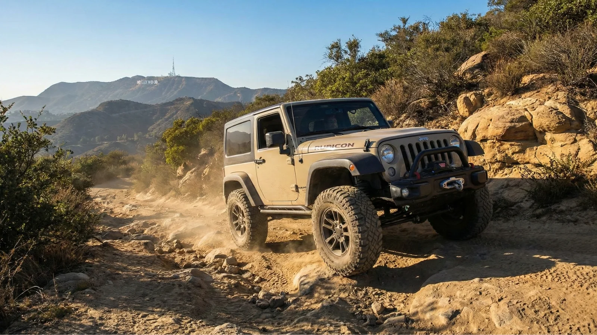
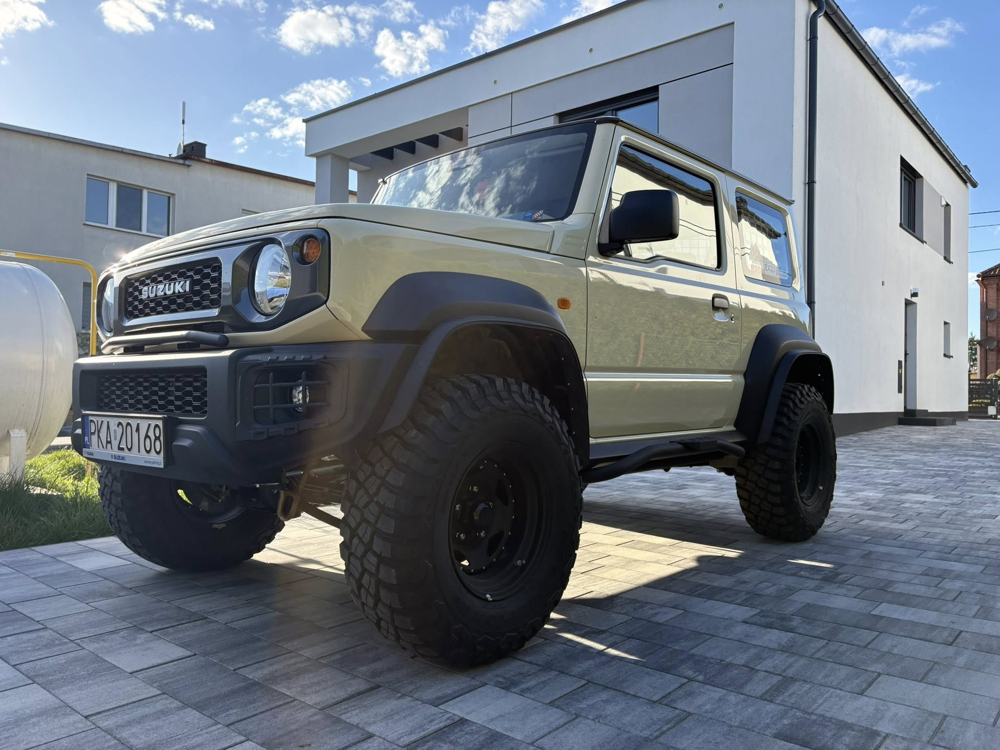
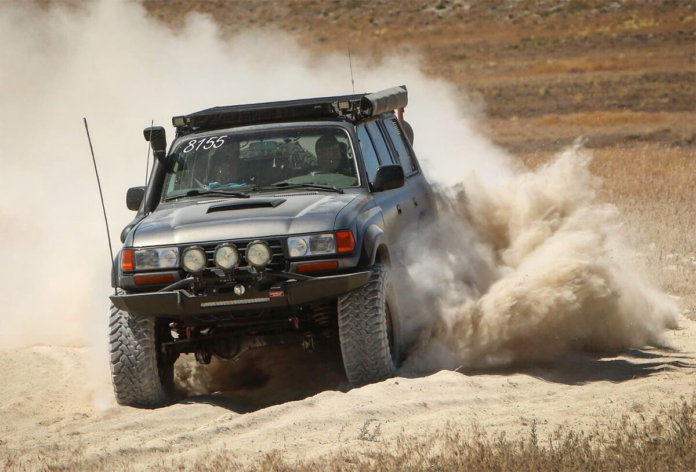
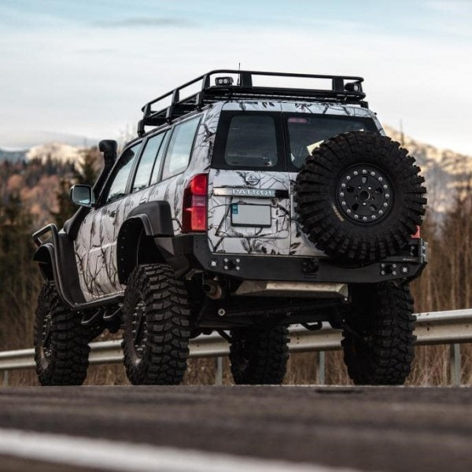

Off-road to coś więcej niż zwykła jazda samochodem. To pasja, przygoda i sposób na oderwanie się od codzienności. Coraz więcej osób marzy o weekendowych wyprawach po błotnistych szlakach, leśnych drogach czy górskich bezdrożach. Nic więc dziwnego, że jednym z najczęściej zadawanych pytań przez początkujących jest: **„Jaki samochód offroadowy wybrać na początek?”**

Odpowiedź nie jest jednoznaczna. Wszystko zależy od budżetu, oczekiwań, rodzaju tras oraz tego, czy auto ma służyć wyłącznie do zabawy w terenie, czy również do codziennej jazdy po mieście. Jedno jest pewne – dobrze dobrany samochód terenowy potrafi sprawić, że pierwsze doświadczenia z off-roadem będą czystą przyjemnością, a nie pasmem awarii i frustracji.

Praktycznym uzupełnieniem tego tematu są materiały [Opony AT i MT w off-roadzie - przewodnik](/artykuly/poradniki-i-technika-jazdy/opony-at-i-mt-czym-sie-roznia/) oraz [Napęd 4x4 w praktyce - jak różne systemy radzą sobie w terenie](/artykuly/samochody-i-testy/naped-4x4-w-praktyce-jak-rozne-systemy-radza-sobie-w-terenie/).

W tym poradniku przyjrzymy się najważniejszym cechom aut terenowych, najlepszym modelom dla początkujących oraz temu, na co warto zwrócić uwagę przed zakupem pierwszej terenówki.

## Czym właściwie jest samochód offroadowy?

Samochód offroadowy to pojazd zaprojektowany do jazdy poza utwardzonymi drogami. W przeciwieństwie do zwykłych aut osobowych posiada:

- napęd 4x4,
- większy prześwit,
- solidniejsze zawieszenie,
- wytrzymałą konstrukcję,
- odpowiednie kąty natarcia i zejścia,
- często reduktor i blokady mechanizmów różnicowych.

Dzięki temu radzi sobie w błocie, piachu, śniegu, na stromych podjazdach i kamienistych trasach.

Warto jednak pamiętać, że nie każdy SUV jest prawdziwą terenówką. Wiele nowoczesnych crossoverów świetnie wygląda, ale w cięższym terenie szybko pokazuje swoje ograniczenia.

---

## Jak zacząć przygodę z off-roadem?

Wielu początkujących popełnia ten sam błąd – kupują drogi samochód, inwestują ogromne pieniądze w modyfikacje, a dopiero później sprawdzają, czy off-road naprawdę im odpowiada.

Znacznie lepszym rozwiązaniem jest:

1. udział w zlotach i wydarzeniach offroadowych,
2. rozmowa z bardziej doświadczonymi kierowcami,
3. jazda jako pasażer w różnych autach,
4. poznanie podstaw techniki jazdy terenowej.

Off-road to bardzo społecznościowe hobby. Właściciele terenówek chętnie dzielą się doświadczeniem i często pozwalają zobaczyć możliwości swoich samochodów w praktyce.

---

## Na co zwrócić uwagę przy wyborze pierwszego auta terenowego?

### 1. Napęd 4x4

To absolutna podstawa. Najlepiej sprawdzają się auta ze stałym napędem na cztery koła lub możliwością ręcznego dołączania napędu.

Do poważniejszego terenu warto szukać modeli wyposażonych w:

- reduktor,
- blokady mostów,
- mechaniczne rozwiązania zamiast elektronicznych imitacji.

---

### 2. Prześwit

Im większy prześwit, tym łatwiej pokonywać przeszkody bez ryzyka uszkodzenia podwozia.

Dla początkujących rozsądne minimum to około 20 cm.

---

### 3. Prostota konstrukcji

Na początek najlepiej wybierać auta:

- proste mechanicznie,
- łatwe w naprawie,
- z dużą dostępnością części,
- popularne w środowisku offroadowym.

Dlaczego? Bo teren szybko weryfikuje nawet najlepsze samochody.

---

### 4. Koszty eksploatacji

Terenówki potrafią być kosztowne w utrzymaniu. Spalanie na poziomie 12–18 litrów nie należy do wyjątków.

Do tego dochodzą:

- opony terenowe,
- serwis zawieszenia,
- zabezpieczenia podwozia,
- wyciągarki,
- lift zawieszenia,
- naprawy po wyprawach.

Dlatego warto dobrze policzyć budżet jeszcze przed zakupem.

---

## SUV czy prawdziwa terenówka?

To jedno z najważniejszych pytań początkujących.

### SUV – dla kogo?

SUV będzie dobrym wyborem dla osób, które:

- chcą jeździć głównie po mieście,
- planują lekkie wyprawy,
- szukają kompromisu między komfortem a możliwościami terenowymi.

SUV sprawdzi się na:

- szutrach,
- leśnych drogach,
- śniegu,
- lekkim błocie.

Ale w cięższym terenie szybko zabraknie mu możliwości.

---

### Prawdziwa terenówka – dla kogo?

Klasyczne auta terenowe są stworzone do trudnych warunków. Posiadają:

- ramową konstrukcję,
- reduktor,
- większy skok zawieszenia,
- solidniejszy napęd.

To najlepszy wybór dla osób, które naprawdę chcą rozwijać się w off-roadzie.

---

## Najlepsze samochody offroadowe dla początkujących

### Jeep Wrangler – legenda off-roadu

Jeep Wrangler to jeden z najbardziej kultowych samochodów terenowych na świecie.

### Zalety:
- świetne właściwości terenowe,
- ogromne możliwości modyfikacji,
- reduktor i blokady,
- potężna społeczność fanów.

### Wady:
- wysokie ceny,
- przeciętny komfort na asfalcie,
- większe spalanie.

To idealna opcja dla osób, które chcą szybko wejść w prawdziwy off-road.

---

### Suzuki Jimny – mały, ale niezwykle skuteczny

Suzuki Jimny udowadnia, że rozmiar nie ma znaczenia.

To jedno z najlepszych aut dla początkujących, ponieważ:
- jest lekkie,
- bardzo zwrotne,
- stosunkowo tanie w eksploatacji,
- radzi sobie zaskakująco dobrze w terenie.

Jimny świetnie sprawdza się:
- na leśnych trasach,
- w błocie,
- na ciasnych technicznych odcinkach.

Jego minusem jest niewielka przestrzeń i ograniczony komfort podczas długich tras.

---

### Toyota Land Cruiser – synonim niezawodności

Toyota Land Cruiser od lat uchodzi za jedną z najbardziej niezawodnych terenówek świata.

### Dlaczego warto?
- legendarna trwałość,
- świetne właściwości terenowe,
- ogromna wytrzymałość,
- komfort podczas dalekich podróży.

To auto idealne na:
- wyprawy ekspedycyjne,
- długie trasy,
- ciężki teren.

Minusem są wyższe koszty zakupu i eksploatacji.

---

### Land Rover Defender – terenówka z charakterem

.jpg)

Land Rover Defender łączy klasyczny charakter z nowoczesną technologią.

Defender oferuje:
- świetny napęd 4x4,
- bardzo dobre kąty terenowe,
- wysoki komfort jazdy,
- nowoczesne systemy wspomagania.

Starsze modele są bardziej surowe i mechaniczne, natomiast nowe wersje oferują wręcz luksusowe warunki podróżowania.

---

### Nissan Patrol – twardziel do ciężkich zadań

Nissan Patrol to samochód uwielbiany przez fanów ekstremalnego off-roadu.

Największe zalety:
- bardzo mocna konstrukcja,
- świetna wytrzymałość,
- duży potencjał do modyfikacji,
- doskonałe właściwości terenowe.

To świetna baza pod bardziej zaawansowane projekty terenowe.

---

## Mercedes Klasy G – luksus i możliwości

Mercedes Klasy G to połączenie luksusu i bezkompromisowego off-roadu.

Choć dziś często kojarzy się z prestiżem, nadal pozostaje bardzo skuteczną terenówką.

### Problem?
Zarówno zakup, jak i utrzymanie potrafią być bardzo kosztowne.

---

## Jakie auto terenowe na początek będzie najlepsze?

Dla początkujących najczęściej poleca się:

| Model | Dla kogo? |
|---|---|
| Suzuki Jimny | początkujący z mniejszym budżetem |
| Jeep Wrangler | osoby chcące rozwijać auto |
| Toyota Land Cruiser | wyprawy i niezawodność |
| Nissan Patrol | cięższy teren |
| Defender | komfort + off-road |

---

## Technologie pomagające w terenie

Nowoczesne auta terenowe oferują wiele systemów wspomagających jazdę:

- blokady mechanizmów różnicowych,
- reduktory,
- systemy kontroli trakcji,
- asystent zjazdu,
- tryby terenowe.

Choć elektronika pomaga, doświadczeni kierowcy nadal najbardziej cenią rozwiązania mechaniczne.

---

## Nowe czy używane auto terenowe?

### Nowe auto

#### Zalety:
- gwarancja,
- nowoczesne technologie,
- mniejsza awaryjność.

#### Wady:
- wysoka cena,
- drogie części,
- więcej elektroniki.

---

## Używana terenówka

### Zalety:
- niższy koszt zakupu,
- prostsza mechanika,
- większy potencjał do modyfikacji.

### Wady:
- ryzyko ukrytych usterek,
- korozja,
- ślady ciężkiego użytkowania.

Kupując używane auto terenowe, koniecznie sprawdź:
- stan ramy,
- korozję podwozia,
- napęd 4x4,
- reduktor,
- mosty,
- historię serwisową.

---

## Czy off-road to drogie hobby?

Krótko? Tak. Ale poziom wydatków zależy od podejścia.

Można:
- zacząć od prostego Jimny’ego,
- jeździć rekreacyjnie,
- stopniowo rozwijać samochód.

Najważniejsze, by nie próbować budować ekstremalnej terenówki już na starcie.

---

## Jaki samochód offroadowy wybrać na początek?

Nie istnieje jeden idealny samochód terenowy dla każdego. Wszystko zależy od:
- budżetu,
- oczekiwań,
- rodzaju tras,
- doświadczenia,
- planów rozwoju w off-roadzie.

Jeśli jednak szukasz uniwersalnej odpowiedzi, to dla większości początkujących najlepszym wyborem będą:
- Suzuki Jimny,
- Jeep Wrangler,
- Toyota Land Cruiser.

To auta sprawdzone, popularne i posiadające ogromne wsparcie społeczności offroadowej.

Najważniejsze jednak jest jedno — zacząć. Bo off-road bardzo szybko staje się czymś więcej niż hobby. To styl życia, który uzależnia od błota, bezdroży i adrenaliny.