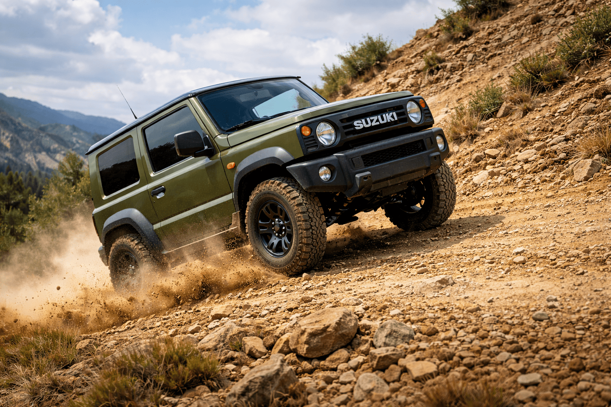
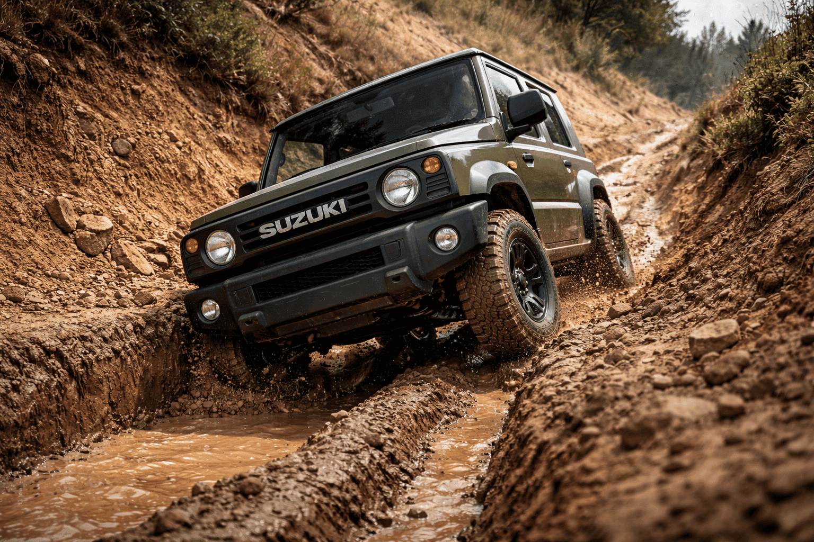
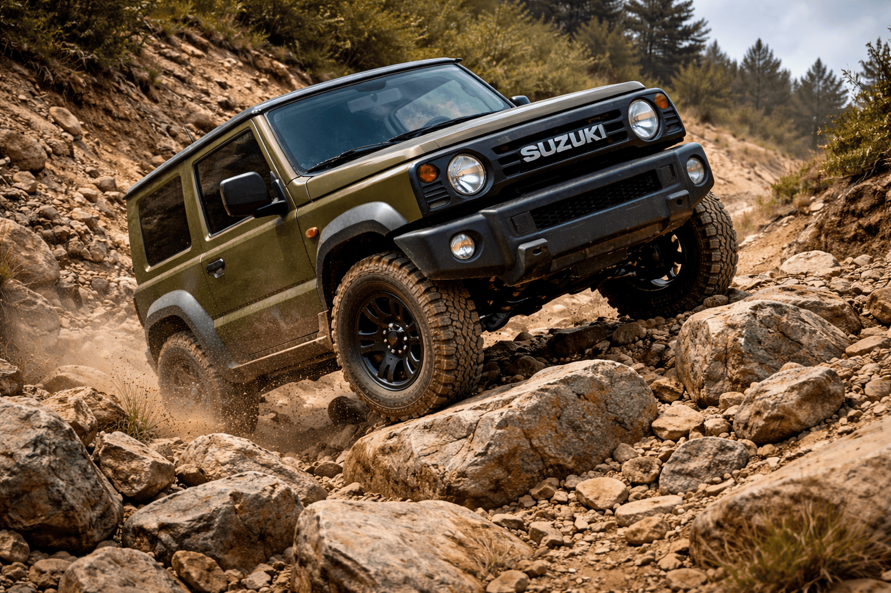
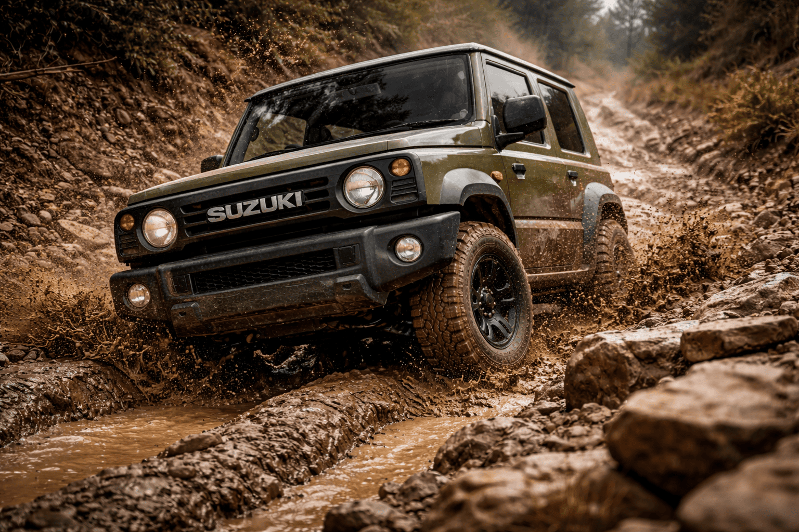
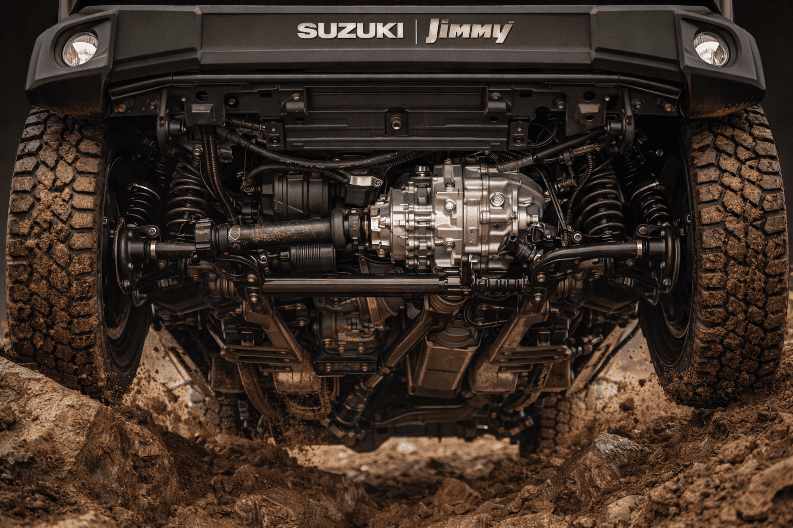
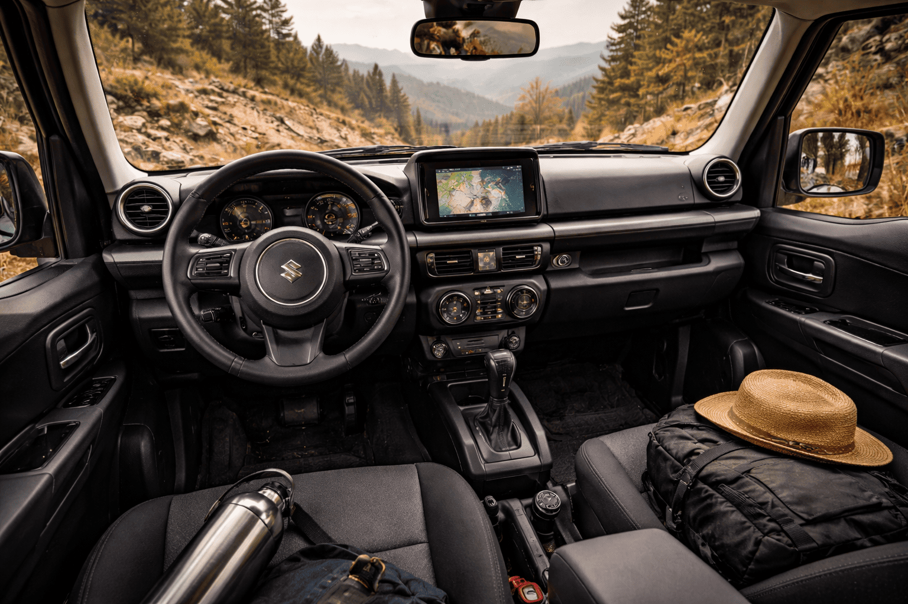

Małe nadwozie, krótki rozstaw osi i rama nośna – w czasach rosnących SUV-ów Suzuki Jimny pozostaje konstrukcyjnym dinozaurem. I bardzo dobrze. Postanowiłem sprawdzić, ile realnie potrafi seryjny Jimny w wymagającym, technicznym terenie: stromych podjazdach, poprzecznych koleinach, w błocie oraz na kamienistych sekcjach o niskiej przyczepności.

Ten test nie jest katalogową prezentacją. To praktyczna weryfikacja, czy niewielka terenówka rzeczywiście może konkurować z większymi konstrukcjami opartymi na ramie.

---

## Konstrukcja, która dziś jest rzadkością

Suzuki Jimny pozostaje jednym z ostatnich małych samochodów z:

- klasyczną ramą drabinową,
- sztywnymi mostami z przodu i z tyłu,
- reduktorem sterowanym mechanicznie,
- dołączanym napędem 4x4.

W testowanym egzemplarzu mieliśmy wersję z manualną skrzynią biegów i przełożeniem redukcyjnym 2.0:1. Silnik 1.5 o mocy 102 KM na papierze nie imponuje. W terenie jednak znaczenie ma coś innego: kontrola momentu, przełożenia i geometria.

### Geometria ważniejsza niż moc

Parametry terenowe seryjnego Jimny:

- kąt natarcia: ok. 37°
- kąt zejścia: ok. 49°
- kąt rampowy: ok. 28°
- prześwit: ok. 21 cm

Krótki rozstaw osi (225 cm) jest tutaj kluczowy. Na stromych załamaniach terenu Jimny niemal nie „wiesza się” na środku, podczas gdy dłuższe SUV-y często wymagają budowania najazdów.

---

## Strome podjazdy na luźnym podłożu

Pierwszą próbą był gliniasty podjazd o nachyleniu około 28–32 stopni, z koleinami po cięższych autach.

### Tryb jazdy

- reduktor włączony,
- drugi bieg na reduktorze,
- stałe, niskie obroty około 2500 rpm.

Jimny pokazał tu swoją największą zaletę – niewielką masę (ok. 1100 kg). Auto nie zapadało się głęboko w miękkim podłożu i nie wymagało agresywnego rozpędu. Kontrola gazu była precyzyjna.

Elektroniczna kontrola trakcji w seryjnej wersji skutecznie dohamowywała uślizgujące się koła. Choć nie jest to blokada mechaniczna, w wielu sytuacjach działa zaskakująco sprawnie.

### Gdzie pojawia się ograniczenie

Na bardziej rozkopanej sekcji, gdzie jedno z tylnych kół całkowicie traciło kontakt, system zaczynał działać z opóźnieniem. Konieczne było utrzymywanie wyższych obrotów, co zmniejszało płynność podjazdu.

Wniosek: seryjna elektronika wystarcza do turystycznego i średnio trudnego offroadu, ale w ciężkim terenie blokada tylnego mostu znacznie poprawiłaby skuteczność.

---

## Trawers i poprzeczne koleiny

Sztywne mosty mają jedną zasadniczą zaletę: przewidywalność pracy zawieszenia. W przeciwieństwie do wielu aut z niezależnym zawieszeniem, Jimny utrzymuje kontakt kół z podłożem nawet przy dużych wychyleniach.

Podczas jazdy w głębokich koleinach boczne przechyły były wyraźne, ale kontrolowane. Środek ciężkości jest stosunkowo wysoko, co wymaga rozsądku.

### Stabilność boczna

Krótki rozstaw osi pomaga w manewrowaniu, lecz przy dużym trawersie trzeba uważać na gwałtowne zmiany kierunku. Jimny jest wrażliwy na dynamiczne ruchy kierownicą.

Rekomendacja: w takich warunkach utrzymywać stałą prędkość, unikać nagłego hamowania i operować kierownicą płynnie. To samochód, który nagradza precyzję.

---

## Sekcja kamienista

Kamieniołom to dobre miejsce do testu prześwitu i elastyczności napędu. Na dużych, ostrych kamieniach zalety krótkiego nadwozia są widoczne natychmiast.

Auto mieści się tam, gdzie większe konstrukcje wymagają dodatkowego manewru. Mały zwis przedni i tylny praktycznie eliminują ryzyko kontaktu z przeszkodą.

### Ochrona podwozia

Seryjne osłony są wystarczające do lekkiego offroadu, ale przy regularnej jeździe po kamieniach zalecam:

- stalową osłonę skrzyni rozdzielczej,
- wzmocnioną osłonę silnika,
- osłony progów.

Rama jest solidna, jednak elementy pomocnicze wymagają dodatkowej ochrony.

---

## Błoto - masa ma znaczenie

W błotnistym odcinku Jimny wykorzystał swoją niską masę i wąskie opony. Testowany egzemplarz miał ogumienie A/T w rozmiarze seryjnym.

W umiarkowanym błocie auto radziło sobie bez potrzeby „rozpędzania się”. Problem pojawia się w głębokich, ciężkich koleinach, gdzie prześwit 21 cm przestaje wystarczać.

### Czy lift jest konieczny

Podniesienie zawieszenia o 40–50 mm znacząco poprawia możliwości:

- zwiększa prześwit,
- poprawia kąty terenowe,
- pozwala zastosować większe opony MT.

Jednak już w seryjnej konfiguracji Jimny zostawia w tyle większość kompaktowych SUV-ów z napędem typu Haldex.

---

## Układ napędowy pod lupą

Reduktor w Jimny to jedna z jego największych zalet. Mechaniczne przełączanie 2H – 4H – 4L daje kierowcy pełną kontrolę.

Przełożenie nie jest ekstremalnie niskie, ale w połączeniu z pierwszym biegiem pozwala na bardzo wolną jazdę techniczną.

### Kultura pracy

W terenie napęd działa przewidywalnie. Nie ma opóźnień typowych dla systemów automatycznie dołączanych. Moment trafia tam, gdzie jest potrzebny – od razu.

Minusem jest brak fabrycznej blokady mechanicznej w większości wersji. Przy budowie auta pod cięższy offroad montaż blokady tylnego mostu to jedna z pierwszych rekomendowanych modyfikacji.

---

## Komfort poza asfaltem

Jimny nie udaje samochodu rodzinnego. Krótki rozstaw osi oznacza wyraźne podskakiwanie na poprzecznych nierównościach.

W terenie nie jest to wada – szybka reakcja zawieszenia pomaga w kontroli auta. Jednak podczas dojazdu asfaltowego trzeba zaakceptować:

- wyższy poziom hałasu,
- wrażliwość na wiatr boczny,
- ograniczoną dynamikę wyprzedzania.

To samochód wyspecjalizowany. Nie próbuje być kompromisem.

---

## Praktyczne modyfikacje, które mają sens

Na podstawie testu, optymalna ścieżka rozwoju Jimny do ambitnego offroadu wygląda następująco:

---

### Etap 1 – podstawy

- opony A/T lub lekkie M/T,
- stalowe osłony podwozia,
- wyciągarka o uciągu 3,5–4 t z lekką liną syntetyczną.

---

### Etap 2 – poprawa trakcji

- blokada tylnego mostu,
- lift 40 mm,
- przewody hamulcowe o zwiększonej długości.

---

### Etap 3 – turystyka wyprawowa

- bagażnik dachowy,
- dodatkowe oświetlenie robocze,
- kompresor pokładowy.

Warto jednak pamiętać, że każda modyfikacja zwiększa masę. A masa jest jednym z głównych atutów Jimny.

---

## Dla kogo jest ten samochód

Jimny nie jest autem do wszystkiego. To narzędzie. Najlepiej sprawdzi się u osób, które:

- jeżdżą solo lub w duecie,
- cenią prostą mechanikę,
- planują realny offroad, a nie tylko dojazd do działki,
- chcą budować auto etapami.

Nie będzie dobrym wyborem dla rodziny z dużym bagażem ani dla kogoś oczekującego wysokiego komfortu autostradowego.

---

## Podsumowanie testu terenowego

W ciężkim terenie Suzuki Jimny udowadnia, że rozmiar nie jest wyznacznikiem skuteczności. Dzięki ramie, reduktorowi i sztywnym mostom oferuje możliwości, które w swojej klasie cenowej są praktycznie niedostępne.

Czy może konkurować z większymi terenówkami? W wielu technicznych sekcjach – tak. W błocie i ciasnych przesmykach często ma przewagę dzięki masie i gabarytom.

Ostatecznie Jimny to samochód, który nie imponuje liczbami, ale broni się w praktyce. W świecie coraz bardziej skomplikowanych systemów napędowych pozostaje przykładem prostej, skutecznej inżynierii.

Mały może więcej – pod warunkiem, że kierowca rozumie jego charakter i ograniczenia.

---

## Źródła

- Dane techniczne producenta Suzuki Motor Corporation
- Materiały homologacyjne modelu Jimny JB74
- Doświadczenia własne z testów terenowych 2025–2026
- Analiza przełożeń i geometrii zawieszenia na podstawie dokumentacji serwisowej
